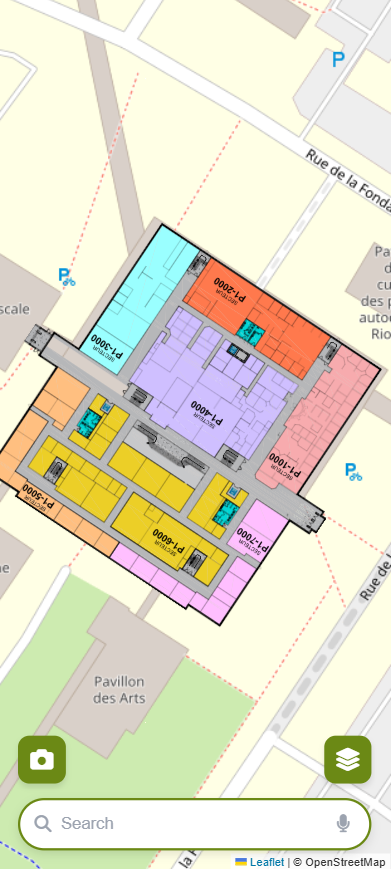
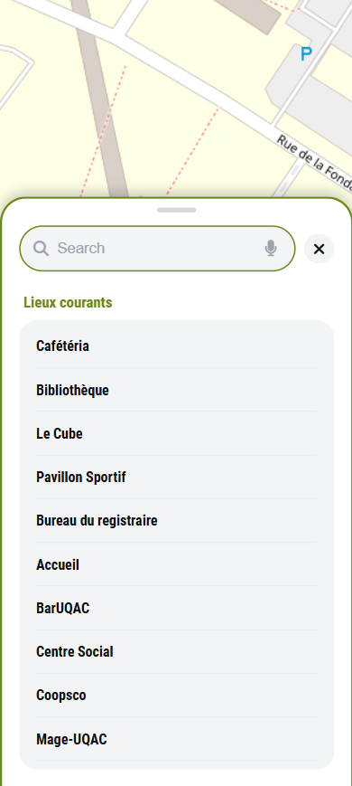
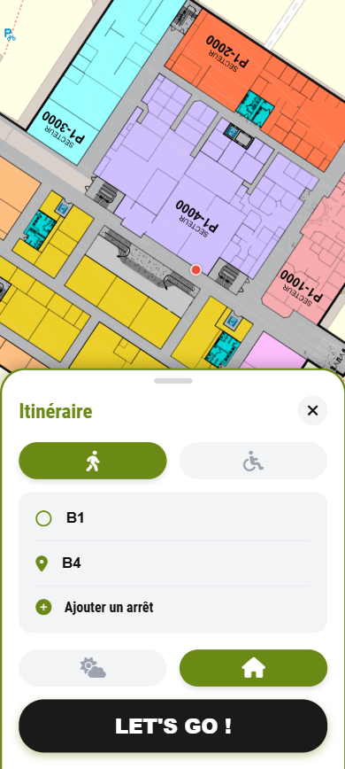
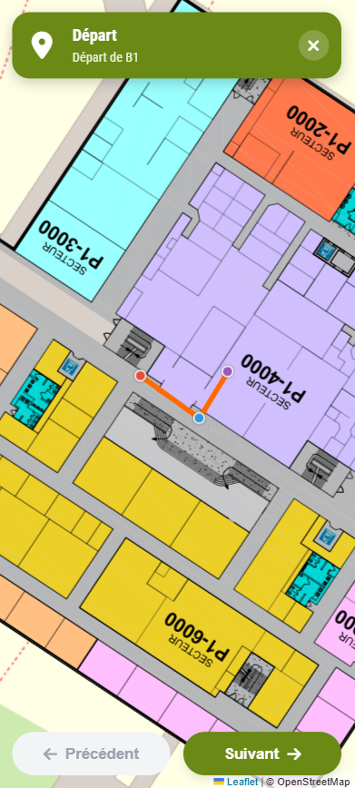

# 🗺️ OùQAC - Le GPS Universitaire Open Source

[](#)
[](#)
[](#)
[](#)
[](https://opensource.org/licenses/MIT)

**OùQAC** est une application web cartographique interactive conçue pour simplifier la navigation sur le campus de l'UQAC (Université du Québec à Chicoutimi). Pensez-y comme le "Google Maps" interne de l'université.

Le projet se divise en deux parties distinctes : une **interface communauté (Mobile-First)** fluide et intuitive et un **Panel Administrateur** complet pour éditer le réseau de navigation (nœuds, chemins, accessibilité).

---

## 🚀 Essayer l'application

OùQAC est une **Progressive Web App (PWA)** fonctionnant entièrement côté client. **Il n'y a aucune installation requise.**

👉 **[Ouvrir le Panel Communauté (Application Utilisateur)](https://miel-uqac.github.io/OuQAC/communaute/)**

*Astuce : Sur iOS/Android, ouvrez le lien dans Safari/Chrome et choisissez "Ajouter à l'écran d'accueil" pour profiter d'une expérience plein écran native.*

---

## ✨ Fonctionnalités Principales

### 📱 Panel Communauté (Interface Utilisateur)
* **Itinéraires Intelligents (Pathfinding) :** Utilisation de l'algorithme **A\*** (A-Star) pour calculer le chemin le plus court entre deux points.
* **Accessibilité PMR :** Option permettant d'exclure les escaliers et les chemins inadaptés aux personnes à mobilité réduite.
* **Filtres d'Environnement :** Possibilité de privilégier les trajets à l'intérieur (Indoor) ou à l'extérieur (Outdoor).
* **Navigation Multi-Étages :** Les cartes se mettent à jour automatiquement selon l'étage de l'itinéraire.
* **Générateur d'étapes :** Instructions textuelles de navigation (ex: "Prendre l'ascenseur", "Sortir du bâtiment", "Tourner à droite").
* **UX Native Mobile :** Animations fluides, "Swipe-down to close", Bottom Sheets, et interception du bouton retour d'Android via l'API History.

### 🛠️ Panel Administrateur (Éditeur de Carte)
* **Création de Graphe Visuel :** Placement de nœuds (salles, couloirs, ascenseurs) et de liaisons (chemins) directement sur la carte.
* **Propriétés Dynamiques :** Définition des règles pour chaque chemin (distance, intérieur/extérieur, PMR).
* **Gestion des étages :** Outil visuel pour lier des nœuds entre différents étages (via des marqueurs spécifiques).
* **Import/Export JSON :** Sauvegarde et chargement de la topologie du campus en un clic.

---

## 📸 Aperçus

| La Carte | Recherche & Lieux Courants | Sélection de l'Itinéraire | Trajet en Cours (GPS) |
| :---: | :---: | :---: | :---: |
|  |  |  |  |

---

## 🏗️ Architecture et Technologies

Ce projet a fait le choix de la légèreté et de la performance en s'affranchissant de frameworks lourds. 

* **Frontend :** Vanilla JavaScript (ES6 Modules), HTML5, CSS3 (Variables, Flexbox).
* **Cartographie :** [Leaflet.js](https://leafletjs.com/) pour le rendu de la carte et la gestion spatiale.
* **Architecture :** Modèle MVC (Model-View-Controller) côté client avec une gestion d'état centralisée (`state.js`).
* **Hébergement :** GitHub Pages.

---

## 📚 Documentation & Wiki

Étant donné la complexité de certaines mécaniques (notamment le système de graphes, l'algorithme A*, et la logique de filtrage multi-étages), une documentation détaillée est à votre disposition.

Pour comprendre le code en profondeur, l'architecture des données JSON, ou savoir comment modifier le comportement de la carte, **[consultez notre Wiki complet ici](../../wiki)**.

---

## 🤝 Contribuer au projet

L'application utilisant des modules JavaScript (ES6), elle doit obligatoirement être exécutée sur un serveur local pour fonctionner correctement lors du développement (afin d'éviter les erreurs de sécurité CORS).

Voici les étapes pour installer et modifier le projet sur votre machine :

### 1. Prérequis : Installer Python
Pour faire tourner un petit serveur local très facilement, nous utilisons Python. Si vous ne l'avez pas encore, téléchargez-le et installez-le depuis le site officiel : [python.org](https://www.python.org/downloads/). 
*(Attention : sur Windows, n'oubliez pas de cocher la case "Add Python to PATH" lors de l'installation).*

### 2. Installation et Lancement
1. **Cloner ou télécharger le dépôt :**
   ```bash
   git clone https://github.com/Miel-UQAC/OuQAC.git
   ```
2. **Ouvrir le dossier :** Accédez au dossier racine du projet que vous venez de récupérer (le dossier `OuQAC`).
3. **Ouvrir un terminal** à l'intérieur de ce dossier.
4. **Héberger le projet en local** en tapant la commande suivante :
   ```bash
   python -m http.server
   ```
   *(Note : sur certains systèmes, la commande peut être `python3 -m http.server`)*
5. **Ouvrir l'application :** Lancez votre navigateur et allez à l'adresse `http://localhost:8000`. Vous pourrez y voir le site et naviguer vers `/communaute/` ou `/admin/`.

📖 **Avant de plonger dans le code :** Pour bien comprendre la structure des fichiers, le rôle de chaque dossier et la logique globale, **[consultez la page Architecture de notre Wiki](../../wiki/Architecture-d'OùQAC)**.

---

## 📄 Licence

Ce projet est sous licence MIT - voir le fichier [LICENSE](LICENSE) pour plus de détails.

---

## 👨‍💻 Auteur

**Baptiste Crepon** - *Créateur & Développeur Principal*
[](https://github.com/baptcrp) 

*Un grand merci à l'UQAC et à ses étudiants pour l'inspiration derrière ce projet.*
